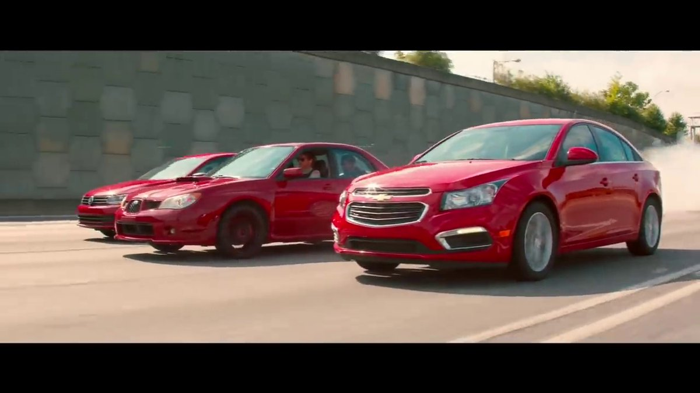

# Which Frame?

Search a video **semantically** with AI. For example, try a natural language search query like "a person with sunglasses". You can search with text, images, or a combined text + image. The underlying querying is powered by [CLIP](https://github.com/openai/CLIP).

---

## Try it out!

https://huggingface.co/spaces/chuanenlin/which-frame

---

## Setting up

1.  Clone the repository.

```python
git clone https://github.com/chuanenlin/whichframe.git
cd whichframe
```

2.  Install package dependencies.

```python
pip install -r requirements.txt
```

3.  Run the app.

```python
streamlit run whichframe.py
```

---

## Examples

### 🔤 Text Search

#### Query

"three red cars side by side"

#### Result



### 🌅 Image Search

#### Query


#### Result


### 🔤 Text + 🌅 Image Search

#### Query

"a red subaru" +


#### Result


